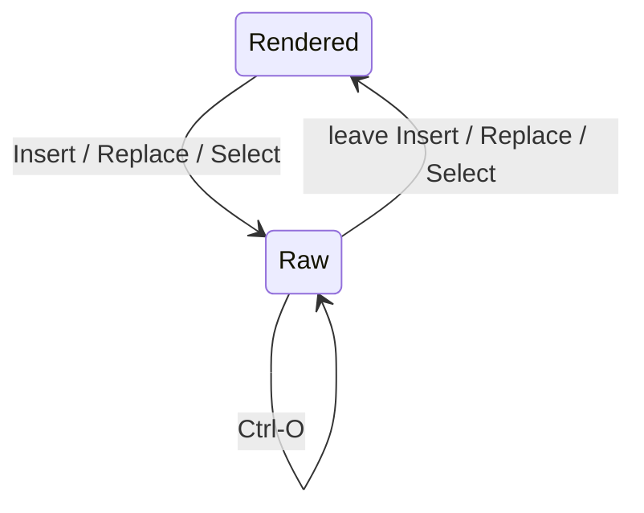

# mada

`mada` (short for MArkDown Artist) renders Markdown buffers in place: styled
in Normal mode, raw in Insert mode, Mermaid fences as diagrams.

v0.1.0. Design:
[docs/requirements.md](docs/requirements.md),
[docs/architecture.md](docs/architecture.md). Implementation follows the
milestones in architecture §16.

## What it does

- Rendered in Normal mode; raw Markdown in Insert, Replace and Select mode.
- Cursor row always shown raw, even while rendered (anti-conceal).
- Mermaid fences render as text diagrams via [termaid](https://github.com/fasouto/termaid), asynchronously, in place of the source.
- Minimal, [glamour](https://github.com/charmbracelet/glamour)-inspired look: no reflow, no margins, no word wrap — rows still map 1:1 to file lines. Pipe tables are the exception: laid out in virtual text with a separator below the header and separators between columns, without outer borders or body row lines.
- Task items hide their bullet; the checkbox takes its place.
- Never modifies the buffer: text, undo history, `modified` and `changedtick` are untouched.



## Requirements

| Component | Needs |
|---|---|
| Neovim | ≥ 0.11 (bundled `markdown`/`markdown_inline` parsers; no nvim-treesitter) |
| Mermaid | [termaid](https://github.com/fasouto/termaid) on `$PATH` — `pip install termaid`, or `mermaid.cmd = {"uvx", "termaid"}` |
| Build | Nix, or Fennel, to compile `src/` to Lua |

Stays off when render-markdown.nvim or markview.nvim is also loaded (FR-M9).

This flake packages termaid: `nix build .#termaid`, and `nix develop` puts
it on `$PATH`. `nix run` (a Neovim with mada installed and set up) has it
on `$PATH` too, so its Mermaid demo blocks render.

## Install

### Nix flake

```nix
{
  inputs.mada.url = "path:/path/to/mada"; # or a git url
  # ...
  programs.neovim.plugins = [ inputs.mada.packages.${pkgs.system}.default ];
}
```

### NixVim

```nix
{
  imports = [ inputs.mada.nixvimModules.default ];
  programs.mada = {
    enable = true;
    settings.ascii = true;
  };
}
```

### Without Nix

Compile the Fennel sources to `lua/`:

```sh
for file in $(find src -name '*.fnl' -type f); do
  dest="lua/${file#src/}"
  dest="${dest%.fnl}.lua"
  mkdir -p "$(dirname "$dest")"
  fennel --compile "$file" > "$dest"
done
```

Put the repo on Neovim's runtimepath. Copy `help/` to `doc/` and run
`:helptags` on it. Without the Nix build, `require("mada").version()`
reports `"dev"`.

## Configuration

Zero-config: `mada` attaches on `FileType markdown` without a `setup()`
call. To change any key, call `setup()` with a subset of the defaults
below (deep-merged; safe to call again — the last call wins):

```lua
require("mada").setup({
  enabled = true,
  filetypes = { "markdown" },
  max_file_lines = 20000,
  raw_modes = { "i", "R", "s", "S", "\19" },  -- first char of mode(1); "\19" is CTRL-S
  anti_conceal = true,
  ascii = false,                              -- ASCII glyphs, and termaid --ascii
  treesitter = { highlight = false, auto_max_lines = 5000 },
                                               -- highlight: "auto" | true | false
  viewport_margin = 20,
  headings = { conceal_markers = false },
  bullets = { "•", "◦", "▪" },
  checkbox = { todo = "[ ]", done = "[✓]" },
  quote = "│",
  rule = "─",
  image_icon = "▣ ",
  code = { hide_fences = true, show_language = true },
  links = { conceal = true, show_url = false },
  tables = {
    style = "unicode",                        -- "unicode" | "off"
    border = {
      v = "│", h = "─", cross = "┼", left = "├", right = "┤",
      top_left = "┌", top_cross = "┬", top_right = "┐",
      bottom_left = "└", bottom_cross = "┴", bottom_right = "┘",
    },
  },
  mermaid = {
    placement = "replace",                    -- "replace" | "off"
    cmd = { "termaid" },                      -- string or list
    args = {},
    width_bucket = 10,
    timeout_ms = 5000,
    pending_text = "rendering diagram…",
  },
  debug = false,
})
```

Code blocks have a subtly darker background band, one space of horizontal
padding, and one shaded row above and below. The language label stays inside
the band. Syntax colours need an active tree-sitter
highlighter. mada stops highlighters by default — including the one Neovim 0.12
starts for markdown buffers — because its conceals under `conceallevel=2` made
redraws 6-7x slower. Set `treesitter.highlight = "auto"` or `true` to keep one
running and get syntax colours back.

Glyphs, highlight groups and their defaults: requirements §7.

## Usage

`:Mada {enable|disable|toggle|render|clear}`, with `!` on `render` to
re-run every Mermaid diagram in the buffer, including failed ones:

| Subcommand | Effect |
|---|---|
| `enable` | Attach the current buffer. |
| `disable` | Detach: clear marks, restore window options, remove autocommands. |
| `toggle` | `enable` if disabled, `disable` if enabled. |
| `render` | Re-render every window showing the buffer. |
| `render!` | `render`, plus re-run every Mermaid diagram, including failed ones. |
| `clear` | Clear marks without detaching. |

Same operations from Lua: `require("mada").{enable,disable,toggle,render,
clear}(buf?)`. Full reference: `:help mada`.

## Docs

- [docs/requirements.md](docs/requirements.md) — what it does and why.
- [docs/architecture.md](docs/architecture.md) — how it's built.
- [docs/contribution.md](docs/contribution.md) — dev shell, build, checks.
