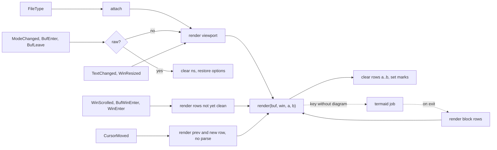
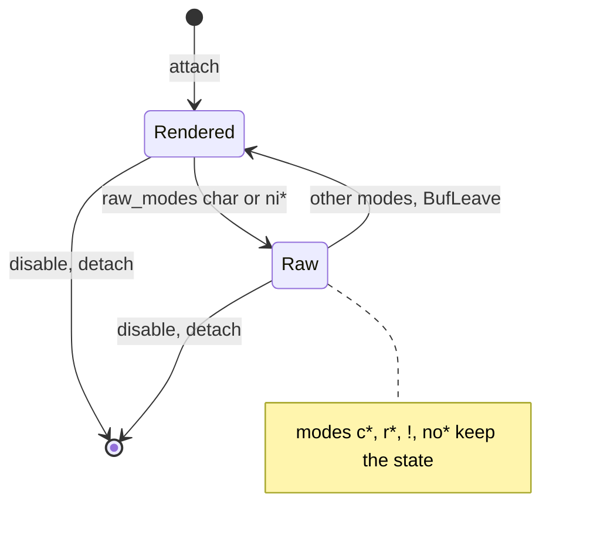
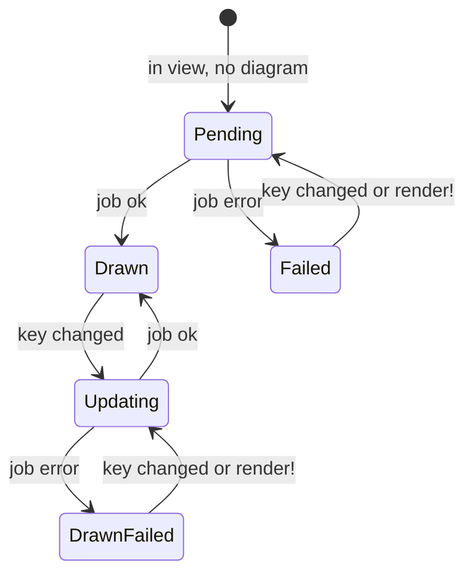
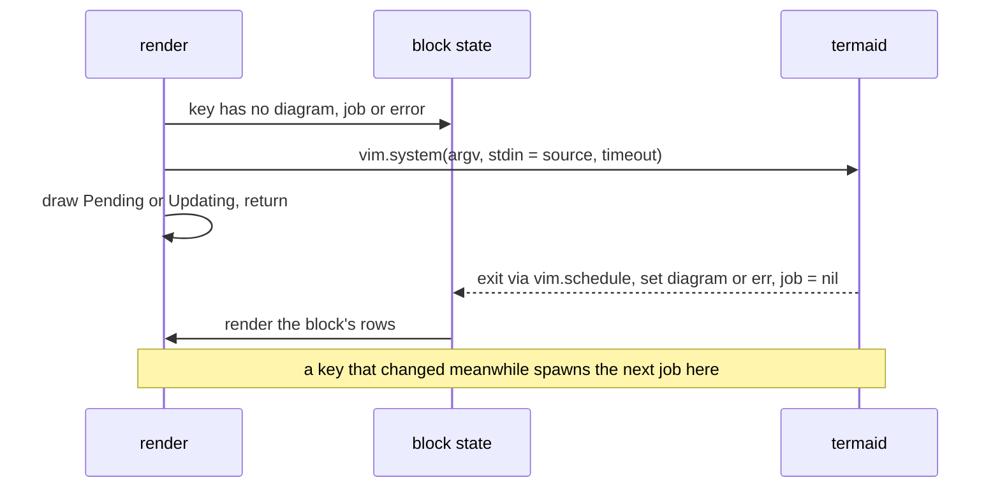

# Architecture

Companion to `requirements.md` (UR-, FR-, NFR-, AT-, OQ- IDs). Fennel compiled ahead of time to Lua for LuaJIT; Neovim ≥ 0.11.

**Rule:** build the simplest design that meets the requirements. Add complexity only when a measurement (AT-24, the health timings) shows a missed budget; §13 lists what is held back.

## 1. Overview



Invariants:

1. The buffer is never written (FR-M6). Visible marks live in namespace `mada`; namespace `mada.anchor` holds one invisible mark per Mermaid block (§8.2).
2. Every mark sits on one row, and `render(buf, win, a, b)` replaces exactly the marks of rows `a..b`. So `render(a, b)` then `render(b+1, c)` equals `render(a, c)`: scroll deltas, anti-conceal and diagram arrival are all the same call.
3. Marks are a pure function of parse tree, lines, cursor row, window width, config and block diagrams (NFR-Q1).
4. Renders are synchronous, inside the triggering autocommand, before the next redraw (FR-T3). Only termaid runs asynchronously.
5. In raw mode no plugin code runs per keystroke (FR-M11).

## 2. Layout and toolchain

```text
src/mada/          Fennel, compiled to lua/mada/ by nix/package.nix
  init.fnl         setup, version, enable/disable/toggle/render/clear, attach/detach
  config.fnl       defaults, validation, glyph resolution
  state.fnl        per-buffer state (own module: breaks require cycles)
  events.fnl       autocommands, mode sync, window options
  render.fnl       render, context, apply
  query.fnl        query strings, compiled once per setup
  block.fnl        block element recipes
  inline.fnl       inline element recipes, entity table
  tables.fnl       pipe-table layout and collector (FR-R13)
  screen.fnl       screen-row helpers for tables and Mermaid (virt_text overlays, padding)
  mark.fnl         mark constructors, overlay_fit, display width
  mermaid.fnl      detection, block state, jobs, placement, termaid argv/parse
  hl.fnl           highlight groups
  health.fnl       :checkhealth mada
  log.fnl          guard, debug log, notify-once, render timing ring
plugin/mada.lua    hand-written: :Mada, FileType autocommand; requires nothing at startup
help/mada.txt
test/              run.lua, helpers.fnl, *_spec.fnl, fixtures/, snapshots/, bin/fake-termaid
bench/latency.lua  AT-24
```

- `nix build` compiles `src/**/*.fnl` and runs `nvimRequireCheck`, so every module must `require` on its own. `nix flake check` adds `fnlfmt --check`, `luacheck` on hand-written Lua, the docs build and `checks.test` (§15). Compiled Lua is not committed (NFR-C3).
- Fennel for LuaJIT: modules are `(local M {}) … M`; `fn`, not `lambda`, in hot paths; no `//` (emits Lua 5.3), use `(math.floor (/ a b))`; `bit.*` explicitly; `var` for rebound locals; escape `\` in query strings.

## 3. State

```text
state[buf] = {
  cfg,
  raw        = bool,
  tick       = changedtick at the last parsing render,
  cursor     = cursor row last seen in the current window,
  clean      = { [win] = {a, b} },                    rows rendered in win since the last edit
  blocks     = { [anchor] = {diagram?, err?, job?} }, §8.2
  started_ts = bool,                                  plugin started the highlighter (FR-M10)
  stopped_ts = bool,                                  plugin stopped a highlighter that was running (FR-M10)
}
vim.w[win].mada = {conceallevel, concealcursor}       saved while rendered
```

Nothing else is kept. Detach clears both namespaces and sets `state[buf] = nil`. `vim.b[buf].mada_disabled` marks a buffer disabled by `:Mada disable` so `FileType` does not re-attach it.

## 4. Events and modes



```text
keep(m)        = m starts with c, r, ! or no                FR-M3: brief trips keep the state
want_raw(m)    = raw_modes[m:sub(1,1)] or m starts with ni
sync(buf)      = unless keep(m): if want_raw(m) ≠ st.raw then enter_raw or enter_rendered
enter_raw      = st.raw = true; clear ns; clean = {}; restore options in every window showing buf
enter_rendered = st.raw = false; for each window showing buf: set options, render_view
render_view(w) = render the viewport range of w; clean[w] = that range
refresh(w)     = render viewport rows of w not in clean[w]; extend clean[w] (replace when disjoint)
```

Window options: `conceallevel = 2`, `concealcursor = anti_conceal and "" or "nvc"`, set with `nvim_set_option_value(…, {scope = "local", win = w})` after saving the old values once in `vim.w[w].mada`; restore writes them back. Local scope ties the values to this buffer in that window, so a window that switches buffer does not inherit them.

| Event | Scope | Action |
|---|---|---|
| `FileType` (configured filetypes) | global; `plugin/mada.lua`, re-registered by `setup` | `attach` |
| `ModeChanged` | global | `sync` the current buffer if attached |
| `WinScrolled` | global | `refresh` each window id in `v:event` |
| `WinResized` | global | `render_view` each window in `v:event.windows` |
| `OptionSet` (`wrap`, `linebreak`, `showbreak`, `breakindent`) | window | `render_view` the window (changes table layout, FR-R13) |
| `ColorScheme` | global | `hl.define` |
| `BufEnter`, `BufWinEnter`, `WinEnter` | buffer | set options if rendered; `sync`; `refresh` |
| `TextChanged` | buffer | `render_view` every window showing the buffer |
| `CursorMoved` | buffer | anti-conceal (§6) |
| `BufLeave` | buffer | `enter_rendered` if raw (FR-M3) |
| `BufReadPost` | buffer | clear both namespaces and `blocks`; `render_view` |
| `FileType` | buffer | detach if the filetype is no longer configured |
| `BufUnload`, `BufWipeout` | buffer | detach |

`attach(buf)`: skip if attached, disabled, over `max_file_lines` (notify only on `:Mada enable`, FR-M2) or another renderer is loaded (FR-M9). Create state and augroup `mada.<buf>`, apply the FR-M10 highlighter action (stop, start, or leave alone, depending on `treesitter.highlight` and what's already running), then `enter_rendered` unless the mode is raw. Because Neovim's runtime `ftplugin/markdown.lua` can start its own highlighter on `FileType` after mada's handler runs, the FR-M10 check repeats once via `vim.schedule`. `FileType` runs before the window's first draw, so the first paint is rendered (FR-T6). Buffer-scoped autocommands plus one global augroup keep FR-M11: no `*I` events, no `nvim_buf_attach`.

## 5. Render

```text
render(buf, win, a, b, parse = true)
  st = state[buf]; stop if missing or raw
  ltree = vim.treesitter.get_parser(buf, "markdown")    the buffer's one LanguageTree, shared with the highlighter
  range = {a, b + 1}
  if parse and not ltree:is_valid(false, range): ltree:parse(range); st.tick = changedtick; inline.invalidate(buf)
  ctx = {buf, win, a, b, cfg, lines = get_lines(a, b + 1), width = text_width(win),
         cursor = st.cursor if win is current, root, ltree,
         sub, ensure_parsed, owned}
  marks = block.collect(ctx) ++ tables.collect(ctx) ++ inline.collect(ctx) ++ mermaid.collect(ctx)
  clear_namespace(buf, ns, a, b + 1)
  for m in marks with a ≤ m.row ≤ b, skipping shifting marks on ctx.cursor when anti_conceal,
      and skipping inline.collect marks at or past ctx.owned[m.row] on an owned row:
    pcall(set_extmark, buf, ns, m.row, m.col, m.opts)                  NFR-Q2
  record duration; emit User MadaRendered {buf, rows = {a, b}}
```

- `ctx.sub(a2, b2)`: a ctx for the row range `a2..b2` with `cursor = -1`, used to run `inline.collect` over a whole table (FR-R13) without touching the outer range or its cursor state.
- `ctx.ensure_parsed(r0, r1)`: parses `r0..r1` only when `ltree:is_valid(false, {r0, r1 + 1})` is false; the table recipe uses it to read rows outside `a..b`.
- `ctx.owned[row]`: byte column past which `render` drops `inline.collect` marks on `row`, because a table recipe already draws that content itself (FR-R13).
- `tables.collect` is a top-level collector (order above: `block.collect`, `tables.collect`, `inline.collect` filtered by `ctx.owned`, `mermaid.collect`). It searches `ctx.a - 1 .. ctx.b + 2` to span the full table in a single collect call. `tables.block_at` mirrors `mermaid.block_at` (§6).
- After any parse the inline tree index is invalidated (`inline.invalidate`): `LanguageTree:trees()` is sparse after a ranged `parse()` in 0.12 and must be walked with `pairs`, not assumed contiguous (§15).
- Inline trees: `ltree:children().markdown_inline:trees()` whose range meets `a..b`.
- Node text is sliced from `ctx.lines`, never `get_node_text`.
- `text_width(win) = nvim_win_get_width(win) - getwininfo(win)[1].textoff`.
- Mark record `{row, col, opts, shifting}`. Constructors in `mark.fnl`: `hl`, `conceal`, `overlay`, `inline`, `line_hl`, `virt_lines`, `conceal_line`, `right_align`, all with `invalidate = true`, `undo_restore = false`, `priority`. Multi-row highlights are split per row (invariant 2). Shifting = `conceal`, `overlay`, `inline`, `conceal_line`.
- `overlay_fit(row, col, end_col, text)`: overlay text never exceeds the display width of the span it covers; overflow goes to an adjacent `inline` mark, underflow conceals the tail. Every glyph substitution uses it.
- Priorities, all below 150 (NFR-I2): block backgrounds 90 · block text 100 · inline 110 + nesting depth (max 119) · conceal/overlay 120 · Mermaid diagrams drawn as overlays (over the block's content rows; fence rows hidden like a code fence) 140. The highlighter draws at 100 in its own namespace, so code-block backgrounds sit under injected syntax colours and the plugin's inline groups win over any `highlights.scm`.

## 6. Anti-conceal (FR-AC3)

Cursor inside a Mermaid block shows the whole source without overlays — fence rows stay hidden except the cursor's own row, revealed like any other anti-concealed row; blank padding `virt_lines` below the first content row keep the block height. Leaving the block restores the overlays.

```text
on CursorMoved(buf)
  prev, st.cursor = st.cursor, cursor row
  stop if unchanged, or changedtick ≠ st.tick           an edit: TextChanged re-renders next
  pb, nb = block_at(prev), block_at(st.cursor)           tree lookup, no parse
  if pb ≠ nb: render both blocks (cursor moved in/out of a block)
  else: render just the row (anti-conceal: drop shifting marks)
  parse = false
```

`block_at(row)`: `root:named_descendant_for_range(row, 0, row, 0)`, walked up to a Mermaid `fenced_code_block`. `concealcursor = ""` reveals the highlighter's conceals on the cursor row (FR-AC5); render drops the plugin's shifting marks there.

## 7. Elements and queries

### 7.1 Recipes

| Element | Marks |
|---|---|
| ATX H1–H6 | `hl MadaHeadingMarker` on marker (`conceal` with `headings.conceal_markers`); `hl MadaH{n}` on text; closing `#`s concealed |
| Setext | text row as ATX; underline row `overlay_fit` with `rule` |
| Emphasis, strong, strike | `conceal` each delimiter; `hl` on content at 110 + depth |
| Code span | `conceal` delimiters; `hl MadaCode` on content |
| Inline link | `conceal` `[` and `](…)`; `hl MadaLink` on text; `show_url` → `inline " (url)"` |
| Reference link | `hl MadaLink` on text; `conceal` brackets and label |
| Autolink | `conceal` `<` and `>`; `hl MadaUrl` |
| Image | `conceal` the span; `inline` `image_icon .. alt` at its start |
| Bullet | `overlay_fit` of `bullets[level]` over the marker; task items instead `conceal` the marker and following spaces (FR-R7) |
| Ordered marker | `hl MadaBullet` |
| Task | unordered: checkbox `overlay_fit` at the concealed marker's column; ordered: checkbox `overlay_fit` over `[ ]`/`[x]` after the number; done → `hl MadaTaskDoneText` on item text |
| Block quote | `overlay` of `quote` on each `>`; `hl MadaQuoteText` on content |
| Fenced code | `conceal_line` on fences (`hide_fences`); `line_hl MadaCodeBlock` on content rows; `right_align` language on the first content row |
| Indented code | `line_hl MadaCodeBlock` per row |
| Thematic break | `overlay` of `rule` over the source + `inline` `rule` to the window width |
| Table | `tables.fnl` (FR-R13), single path: rows never concealed or hidden; grid lines drawn as overlays at window column 0, one per screen row S of that row; lines beyond S in `virt_lines` mark; inline marks on non-cursor rows dropped; cursor row raw in place, lines below keep count with cells blanked, rule kept; top border `virt_lines_above` the header; delimiter row shows header rule (or bottom border when no body); body rows show content then rule after |
| HTML comment | `hl MadaComment` per row |
| Front matter | `line_hl MadaComment` per row |
| Backslash escape | `conceal` the `\` |
| Entity, numeric reference | `conceal` with the decoded character (numeric via `vim.fn.nr2char`, named via a small table of common entities; others untouched) |
| Hard break `\` | `conceal` the `\` |
| Mermaid | §8 |

### 7.2 Queries

Plugin-owned, never the runtime `highlights.scm` (it varies per install and carries no structure). Compiled once per `setup`. If a query fails to compile (a newer grammar renamed a node), drop the patterns that fail on their own and compile the rest, logging at debug (NFR-C1). Node names match the grammars bundled with 0.11; confirm at M0 (OQ-3).

```scheme
; markdown
(atx_heading (atx_h1_marker) @h1.marker) @h1
(atx_heading (atx_h2_marker) @h2.marker) @h2
(atx_heading (atx_h3_marker) @h3.marker) @h3
(atx_heading (atx_h4_marker) @h4.marker) @h4
(atx_heading (atx_h5_marker) @h5.marker) @h5
(atx_heading (atx_h6_marker) @h6.marker) @h6
(setext_heading (setext_h1_underline) @setext.underline) @setext.h1
(setext_heading (setext_h2_underline) @setext.underline) @setext.h2
(list_item [(list_marker_minus) (list_marker_plus) (list_marker_star)] @bullet)
(list_item [(list_marker_dot) (list_marker_parenthesis)] @ordered)
(list_item (task_list_marker_unchecked) @task.todo)
(list_item (task_list_marker_checked) @task.done)
(block_quote (block_quote_marker) @quote.marker) @quote
(fenced_code_block
  (fenced_code_block_delimiter) @code.fence
  (info_string (language) @code.lang)?
  (code_fence_content)? @code.body) @code.block
(indented_code_block) @code.indented
(thematic_break) @rule
(pipe_table (pipe_table_header) @table.header) @table
(pipe_table (pipe_table_delimiter_row) @table.delim)
(pipe_table (pipe_table_row) @table.row)
(html_block) @html
(minus_metadata) @metadata
(plus_metadata) @metadata
```

```scheme
; markdown_inline
(emphasis (emphasis_delimiter) @emph.delim) @emph
(strong_emphasis (emphasis_delimiter) @strong.delim) @strong
(strikethrough (emphasis_delimiter) @strike.delim) @strike
(code_span (code_span_delimiter) @code.delim) @code.span
(inline_link) @link
(image) @image
(full_reference_link (link_text) @link.text) @link.ref
(collapsed_reference_link (link_text) @link.text) @link.ref
(shortcut_link (link_text) @link.text) @link.ref
(uri_autolink) @autolink
(email_autolink) @autolink
(backslash_escape) @escape
(entity_reference) @entity
(numeric_character_reference) @entity
(hard_line_break) @hardbreak
(html_tag) @html
```

`@html` renders only when the text starts with `<!--`; `@hardbreak` only when it starts with `\`. Iteration: `for id, node in q:iter_captures(root, buf, a, b + 1) do dispatch[q.captures[id]](ctx, node, marks) end`; unknown captures are ignored, containers are read through `node:parent()`, and list level is the number of `list` ancestors.

## 8. Mermaid

### 8.1 Detection and key

- A Mermaid block is a `@code.block` whose info string's first token (before whitespace or `{`) is `mermaid`, any case (FR-D1). Source = content rows with the fence's column stripped (this also removes `>` prefixes inside quotes). Empty source: ordinary code block.
- `key = source .. "\0" .. bucket .. "\0" .. tostring(ascii)`, with `bucket = w - w % width_bucket` for `w = text_width(win)`. A plain string compare: no hash, no shared cache (D5).

### 8.2 Block state

Identity: an invisible mark in `mada.anchor` on the opening fence row (`invalidate = true`, `undo_restore = false`), created on first render and found again with `get_extmarks` on that row. It survives raw mode (only `mada` is cleared) and edits elsewhere; deleting the fence row deletes it, orphaning its entry until detach or `:e!`.

```text
blocks[anchor] = {
  diagram = {key, chunks}?,   latest completed diagram, possibly for an older key
  err     = {key, msg}?,      latest error
  job     = key?,             key of the running job
}
```



| State | Shows (`replace`) |
|---|---|
| Pending | code block + `pending_text` row |
| Drawn, Updating | diagram; Updating shows the previous one (FR-D17) |
| Failed | code block + error row |
| DrawnFailed | diagram + error row |

`mermaid.collect(ctx)`, per block meeting `a..b`:

```text
if placement == "off" or termaid is missing: fenced-code marks (FR-R10); done
s = blocks[anchor]
if s.diagram?.key ≠ key and not s.job and s.err?.key ≠ key: spawn(s, key, source)
fence rows: conceal_lines (like code.hide_fences), always
if not s.diagram:
  content rows: line_hl MadaCodeBlock; pending/error row as virt_lines below the LAST content row
else:
  if ctx.cursor not in block: overlay diagram onto the content rows (virt_text_win_col = 0, padded to window width), one per row
  else: show whole source (fence rows stay hidden except the cursor's own row, anti-conceal), no overlays
  blank overlay rows if diagram shorter than content
  virt_lines below the FIRST content row: diagram overflow + error row if s.err?.key == key
```

Block row rendering: fence rows are hidden with `conceal_lines`, like an ordinary code fence (`code.hide_fences`) — Neovim's own tree-sitter highlighter would hide them anyway, so nothing may ever be anchored on a fence row. Diagram is drawn as `virt_text_win_col = 0` overlays over the block's CONTENT rows only, padded to the window width; row 0 of the diagram maps to the first content row. If the diagram has fewer rows than the content, the remaining rows receive blank overlays. Diagram rows beyond the content rows are attached as one `virt_lines` mark below the FIRST content row, so the diagram stays contiguous and the virtual lines always sit between two visible rows (a `virt_lines` mark directly above a hidden fence row made Neovim's scroll-up snap back, §13). When the cursor is inside the block, all overlays are dropped, showing the whole source (fence rows stay hidden except the cursor's own row, via anti-conceal); blank `virt_lines` below the first content row stay, keeping the block height equal to the drawn case. Pending/error state with no diagram: ordinary code-block marks (fences hidden per `code.hide_fences`) plus the pending/error row as `virt_lines` below the LAST content row.

### 8.3 Jobs



- `argv = cmd ++ {"--width", bucket} ++ (ascii and {"--ascii"} or {}) ++ args`; never `--theme` (it emits ANSI). `vim.system(argv, {stdin = source, text = true, timeout = timeout_ms}, on_exit)`.
- Result: exit 0 → stdout lines, leading *and* trailing blanks dropped (real termaid output may start with blank lines), tabs expanded (none left → error `"empty output"`), stderr ignored on exit 0; exit 124 (`vim.system` timeout) → `"timeout"`; otherwise the first stderr line or `"exit <code>"`.
- Chunks: per line, runs of box-drawing and arrow characters (U+2500–U+259F, U+25A0–U+25FF, U+2190–U+21FF) and `-|+<>^v` get `MadaDiagramLine`, other runs `MadaDiagramText`; built once per result (FR-D14).
- `on_exit` → `vim.schedule`: stop if `state[buf]` is gone or replaced (FR-M8); set `job = nil` and `diagram` or `err`; if rendered, render the block's rows (found from the anchor row); emit `User MadaDiagram {buf, row, status}`.
- One job per block. No concurrency limit, no sharing across buffers, no cancellation: a job for an old key completes and becomes the last diagram.
- `:Mada render!`: clear `err` and set `diagram.key = nil` for every block of the buffer, then `render_view`.
- termaid missing (`exepath(cmd[1]) == ""`, checked once per session): blocks render as code blocks; one WARN (FR-D3).

## 9. Configuration

Defaults (README's table must match, FR-C3):

```lua
{
  enabled = true,
  filetypes = { "markdown" },
  max_file_lines = 20000,
  raw_modes = { "i", "R", "s", "S", "\19" },  -- first char of mode(1); "\19" is CTRL-S
  anti_conceal = true,
  ascii = false,                              -- ASCII glyphs, and termaid --ascii
  treesitter = { highlight = false, auto_max_lines = 5000 },
                                               -- highlight: "auto" | true | false
  viewport_margin = 20,
  headings = { conceal_markers = false },
  bullets = { "•", "◦", "▪" },
  checkbox = { todo = "[ ]", done = "[✓]" },
  quote = "│",
  rule = "─",
  image_icon = "▣ ",
  code = { hide_fences = true, show_language = true },
  links = { conceal = true, show_url = false },
  tables = {
    style = "unicode",                        -- "unicode" | "off"
    border = {
      v = "│", h = "─", cross = "┼", left = "├", right = "┤",
      top_left = "┌", top_cross = "┬", top_right = "┐",
      bottom_left = "└", bottom_cross = "┴", bottom_right = "┘",
    },
  },
  mermaid = {
    placement = "replace",                    -- "replace" | "off"
    cmd = { "termaid" },                      -- string or list
    args = {},
    width_bucket = 10,
    timeout_ms = 5000,
    pending_text = "rendering diagram…",
  },
  debug = false,
}
```

`setup` deep-merges, then validates against a flat schema (`["mermaid.timeout_ms"] = "number"`, `["tables.style"] = {"unicode", "off"}`, …): unknown keys and wrong types raise with the key path (FR-C1). With `ascii = true`, glyphs the user did not set take the fallbacks in requirements §7.4. `setup` re-registers the `FileType` autocommand and re-renders attached buffers (FR-C2).

## 10. Highlights

`hl.define()` on `setup` and `ColorScheme`: `nvim_set_hl(0, group, {link = target, default = true})` for every group in requirements §7.2. A group that adds an attribute (bold, underline, italic) instead copies the target's resolved attributes from `nvim_get_hl(0, {name = target, link = false})` and adds it, still `default = true`.

## 11. Health

`:checkhealth mada` (FR-H): Neovim ≥ 0.11; `markdown` and `markdown_inline` parsers load; termaid found and a smoke render of `graph LR; A-->B` via `vim.system(…):wait(3000)`, the only blocking call (NFR-P4); Python present when `cmd[1]` is `termaid`; conflicting renderers (`package.loaded["render-markdown"]`, `package.loaded["markview"]`); rendered windows whose `conceallevel`/`concealcursor` differ from what the plugin set; highlighter state and who started it; p95/max of the last 100 renders — labelled and checked against NFR-P10 (the ring mixes non-edit renders with parse-bound edit renders, so NFR-P1's tighter budget would false-alarm); config summary.

## 12. Errors and logging

- Every autocommand, the job exit callback, `:Mada` and the Lua API (except `setup`) run through `log.guard(label, buf, fn, ...)` (`xpcall`), as does `ColorScheme`. On error: log the traceback, `disable(buf)`, one ERROR notification per distinct error (NFR-Q4). `guard` always returns `nil`: an autocommand callback that returns truthy gets deleted by Neovim after firing once, so no caller may tail-call it.
- `debug = true` appends render timings and job spawn/exit/duration to `stdpath("log") .. "/mada.log"`. Otherwise only WARN/ERROR notifications, once per topic.
- Render durations go into a 100-entry ring per label regardless, for health and the bench.

## 13. Performance

Renders cover the viewport range; scrolling renders only new rows; anti-conceal renders at most two rows or one block, without parsing; raw mode runs nothing per keystroke; termaid runs only when a block's key changes, off the main loop. `bench/latency.lua` (AT-24) and the health ring measure the rest; §5.1 has the budgets and M5's measurements.

**Applied levers**, each measured before keeping:

| Lever | Trigger | Measured effect |
|---|---|---|
| Skip `MadaRendered`'s `nvim_exec_autocmds` when nothing listens | Renders vastly outnumber listeners | Avoids the match+dispatch cost on every render |
| Skip `ltree:parse` when `ltree:is_valid()` | CursorMoved/WinScrolled re-renders on rows already parsed | No parser call when nothing changed since the last parse |
| Inline trees cached per changedtick, filtered by a linear scan | Filtering inline trees showed up on large documents | Sorting cost more at 20k lines (~4.5-4.8ms/edit) than an unsorted array + linear scan (~0.03ms) |
| Link-reference definitions via a compiled query, cached per changedtick, computed only when a reference link is in range | Walking the buffer for definitions on every render | A render with no reference-style link in range pays nothing |
| Queries compiled once per session | Recompiling on every `setup()` call (FR-C2) | ~10 ms compile paid once per session |
| Done-task highlight bounded by an `@task.done.item` capture, not a whole-tree walk | Task highlight cost on large documents | A one-row render went from 6.3 ms to 0.14 ms p95 |
| Highlighter off by default; `treesitter.auto_max_lines` caps `"auto"` | Starting a highlighter costs +19 ms/keystroke on the reference document (OQ-4) | Default keystroke cost back near zero (NFR-P6) |
| Stop Neovim's runtime highlighter by default | Neovim 0.12's `ftplugin/markdown.lua` starts one under `filetype plugin on` (Neovim's default); its `conceal_lines` under `conceallevel=2` made a full-page `<C-f>` redraw on `reference.md` 6–7× slower (Neovim alone 7.4 ms median, mada with the highlighter running 49.9 ms; removing only the query's `conceal_lines` gave 10.8 ms) | Mada after stopping it: 6.7 ms median, back near Neovim's own baseline |
| Table layout cache, keyed on changedtick, window width, `wrap` and the config table; a cache hit only emits marks | Table layout (wrapping, width shrink) recomputed on every render of a table's rows, even unaffected by the triggering event | Single-row cursor re-render on a 40-row, 4-column table 3.96 → 0.39 ms p95 |
| Table rows drawn as window-column overlays over their own screen rows (no conceal, no hidden rows) | Blank rows and broken scrolling with `conceal_lines` hidden rows; user-reported 2026-09-25 | `<C-e>` 1–2 lines per step, `<C-y>` −1, `j`/`k` by row heights; no blank rows at EOF |
| Mermaid diagrams drawn as overlays over the block's own rows; nothing hidden | Scroll-up loop: hidden rows + large virt_lines blocks broke Neovim scroll; hidden Mermaid row hid its own virt_lines, broke diagram attachment; user-reported 2026-09-26 | `G` then `<C-y>` reaches top (714 steps, 0.7 ms median per step); no stutter or jump |
| Mermaid refined: fence rows hidden again (like code fences); diagram overlays only the content rows; overflow as one `virt_lines` mark below the FIRST content row, never directly above a hidden row | The all-overlay design cut off real diagrams (docs/architecture.md's own first diagram lost its first line and 22 overflow lines) and a down-then-up `<C-y>` round trip still snapped back; user-reported 2026-09-28 | First diagram of architecture.md draws complete; a down-then-up `<C-y>` round trip reaches the top in 751 steps with every screen matching a fresh render (was stuck after 291) |
| ASCII fast-path + memo for width: printable-ASCII byte length (no call), or module-level memo for everything else (`nvim_strwidth`, `strdisplaywidth`) | `strdisplaywidth` calls showed up in table layout profiles | Per-character width 0.71 → 0.009 ms per 5,339-char pass |
| Table projection indexes row marks once; wrapping works on words, not characters | Row wrapping cache computed once per table event | Tables collector on the 40-row table (cold, after an edit) 12.47 → 9.38 ms; per page render on reference.md 1.04 → 0.98 ms |

Remaining table cost is spread across tree-sitter row walks, per-run scans, and the inline pass running twice over table rows. P1/P7/P8 p95 set to measured floors (§5.1) instead of further optimisation (user decision 2026-09-25).

**Mermaid scroll-up fix (2026-09-26):** large virt_lines blocks hanging below a concealed row caused Neovim's scroll-up to stutter and jump: Neovim stepped through the hidden row as topfill, then cursor-visibility correction snapped topline back (endless loop). The design was changed: block rows are no longer hidden; diagrams are overlays over the block's own rows; pending/error lines are virt_lines below the fence instead of above it. Measured: scroll-up reaches the top reliably (G then C-y in 714 steps median, 0.7 ms/step; with hidden rows: stuck at line 81 after 2,000 steps).

**Mermaid placement refinement (2026-09-28):** the all-overlay design (nothing hidden) turned out to still cut off real diagrams and could still snap on scroll-up. With Neovim's runtime highlighter also running (`filetype plugin on`, the real default), the first diagram in docs/architecture.md lost its first line and 22 overflow lines, and a down-then-up `<C-y>` round trip got stuck after 291 steps: some overflow `virt_lines` sat directly above a hidden fence row (the highlighter conceals fence rows independently of mada). The design was refined: fence rows are hidden again by mada itself (`conceal_lines`, like `code.hide_fences`) — nothing may ever be anchored on them regardless of whether a highlighter also hides them — and the diagram overlays only the block's content rows, with overflow anchored as one `virt_lines` mark below the FIRST content row, always between two visible rows. Measured: the first diagram of architecture.md now draws complete; a down-then-up `<C-y>` round trip reaches the top in 751 steps with every screen matching a fresh render.

**Tried and reverted:** limiting the first render to visible rows only — no measurable gain, because the root parse tree-sitter builds is whole-document regardless of the range passed to `parse()`.

**Still held back**, with triggers:

| Lever | Trigger |
|---|---|
| Debounce `TextChanged`/`WinScrolled` | Renders over NFR-P1/NFR-P10 during repeated edits or fast scrolling |
| Shared diagram cache, then pre-render on open | Diagrams appear too late (OQ-6 measured them fast enough; not needed) |
| Job concurrency limit | Many blocks in view spawn too many processes |
| Decoration provider (`on_win`) | Events fire after the redraw (OQ-5) |

## 14. Edge cases

| Case | Handling |
|---|---|
| Tabs | `strdisplaywidth` honours `tabstop`; overlays never span a tab; a marker after a tab gets `hl` only |
| Wide or combining characters | Display widths for all overlay fitting |
| CRLF | Nothing: lines carry no `\r` in memory |
| Closed folds | Nothing: Neovim hides marks in folds |
| `wrap` | Works; the right-aligned language label wraps with its line |
| One buffer, two windows | Marks are buffer-scoped; width from the rendering window (FR-D16); `clean` per window |
| `diff` | Not special-cased; hidden rows can misalign a diff (documented) |
| Edit between parse and apply | `pcall` per `set_extmark`; the next render corrects it |
| `:e!` | `BufReadPost` resets namespaces and block state |
| Very long lines | Overlay and inline extension capped at the window width |
| Fences in lists or quotes | Source stripped to the fence column (§8.1) |
| Unterminated fence | Block runs to end of buffer; only the opening fence is hidden |
| `<C-o>`, `<C-o>:` from Insert | Stay raw (§4) |
| Macros, `:normal` | Same handlers; `TextChanged` fires once typeahead ends |

## 15. Testing

- Specs: `test/<area>_spec.fnl`, each returning an ordered list of `[name test-fn]` pairs.
- `test/run.lua <spec>`: `require("fennel").install()`, prepend the built plugin to `runtimepath`, run the spec's tests in order, print `ok name` or `FAIL name: err`, then a final `N tests, M failed` summary line; exits non-zero on any failure, including zero tests defined (a spec that errors while loading or defines none is a visible failure, not a silent no-op). `checks.test` runs each spec in its own `nvim --headless -u NONE -l test/run.lua <spec>` process with `HOME` set to a temp dir: isolation by process, no framework.
- `test/helpers.fnl`: `eq`; `open` (fixture in a window); `feed` (`nvim_feedkeys(keys, "xt", false)`, or `"xt!"` to stay in Insert); `marks` (`nvim_buf_get_extmarks(…, {details = true})` without ids, sorted); `snapshot` (compare with `test/snapshots/<name>.lua`, rewrite when `UPDATE_SNAPSHOTS=1`); `wait_diagram` (`vim.wait` on `User MadaDiagram`). `CursorMoved`/`WinScrolled`/`TextChanged` never fire from `nvim_feedkeys` in a `-l` script (OQ-5), so `feed` fires them itself via `nvim_exec_autocmds` when their precondition changed. `nvim_feedkeys` with the `!` flag, or any keys that leave Nvim parked in Insert or command-line mode, kills a `-l` script's process instead of returning, so scenarios that need to observe real Insert-mode state (`test/modes_spec.fnl`, `test/events_spec.fnl`, `test/mermaid_spec.fnl`) instead spawn a child Neovim with `nvim --embed --headless -u NONE` over RPC (`vim.fn.jobstart(..., {rpc = true})`) and drive it with `nvim_input`/`nvim_exec_lua`, which also gives genuine `v:event` data for `WinScrolled` etc.
- `bench/latency.lua` uses the same `--embed` RPC child technique, and forces a redraw after each input with `vim.api.nvim__redraw({flush = true})` so a tree-sitter highlighter's per-redraw decoration-provider cost is actually paid (no UI is attached, so Neovim would otherwise never redraw).
- Every RPC child Neovim used by bench and by specs that exercise real Insert-mode or highlighter behaviour runs `filetype plugin on` before opening a fixture, matching Neovim's actual default. That is what starts Neovim 0.12's runtime `ftplugin/markdown.lua` highlighter, which `treesitter.highlight = false` must then stop (§13); a spec or bench that skips it exercises a highlighter-free Neovim that does not match what users run.
- Stopping a highlighter re-fires the `syntaxset` `FileType` autocommand; with `:syntax on` (Neovim's default) that would re-enable regex `syntax/markdown.vim` (which has its own conceals), so mada forces the buffer's `syntax` option to `""` while attached under `treesitter.highlight = false` (FR-M10, FR-M11).
- A `virt_lines` mark anchored directly above a row hidden by `conceal_lines` makes Neovim's scroll-up (`<C-y>`) snap back: Neovim steps through the hidden row as topfill, then cursor-visibility correction resets `topline` (§13). Anchored between two visible rows, `virt_lines` are safe — why Mermaid overflow attaches below the first content row rather than above or below a fence row.
- Every RPC child Neovim (`bench/latency.lua`, `test/events_spec.fnl`, `test/mermaid_spec.fnl`, `test/modes_spec.fnl`) is spawned with `-n -i NONE`: these children are killed with `jobstop`, not exited cleanly, which otherwise leaves a swap file behind on every run; later runs then open the fixture/reference document against a pile of stale swap files, which measurably degraded latency run over run (bench P10 crept 12 -> 39 ms across runs before this fix).
- Fixtures: one per element class (AT-18), `reference.md`, `mermaid.md`, `nested.md`, `tabs.md`.
- Invariant 2: for every fixture, a full render equals the union of single-row renders.
- Fake backend: `mermaid.cmd = {"test/bin/fake-termaid"}`, a POSIX sh script that prints `$FAKE_OUT` (or a canned diagram), sleeps `$FAKE_SLEEP`, and exits `$FAKE_CODE` (default 0). No Python in CI.
- Latency (AT-24): `nix run .#bench` runs `bench/latency.lua` on the reference document with and without the plugin and prints p95/max per event against the requirements §5.1 budgets. Run it on the reference machine before closing a milestone; it is not in `nix flake check` because timings are machine-specific.
- `LanguageTree:trees()` is sparse after a ranged `parse()` in 0.12 (only the parsed range's subtrees appear) and must be walked with `pairs`; missing this caused a bug where inline styling was absent in regions reached by scrolling without an edit, fixed by invalidating the inline tree index (`inline.invalidate`) after every parse (§5).
- Headless Neovim cannot make a window wider than the startup grid, and a lone window always spans `columns`; tests size windows with `:vsplit` + `nvim_win_set_width`.
- Scripted `nvim_win_set_cursor` fires no `CursorMoved`; specs set `state.get(buf).cursor` directly.

## 16. Milestones

| M | Scope | Done when |
|---|---|---|
| M0 | config, state, events, mode sync, window options; `render` with ATX headings; anti-conceal; `:Mada`; health skeleton; test and bench harnesses. Settle OQ-1, OQ-2, OQ-3 and OQ-5 with throwaway experiments and record the answers here | AT-1–AT-6, AT-14, AT-16, AT-17, AT-22, AT-23, AT-25, AT-26 |
| M1 | Mermaid: detection, anchors, block state, jobs, termaid and fake backends, `replace`/`off`, pending/updating/error rows, block reveal | AT-7, AT-9–AT-13, AT-28; termaid checked by hand on flowchart, sequence, gantt, pie |
| M2 | Block elements: code blocks, lists, tasks, quotes, rules, tables, setext headings, front matter, HTML comments | Snapshots (AT-18) |
| M3 | Inline elements: emphasis, code spans, links, images, escapes, entities, hard breaks | Snapshots; nesting priority checked |
| M4 | `ascii`, `treesitter.highlight` modes, conflict detection, full health, `:help mada` | AT-15, AT-19–AT-21, AT-29 |
| M5 | Run AT-24 on the reference machine; optimise only missed budgets (§13); settle OQ-4 and OQ-6 | Every AT passes; requirements §5.1 budgets met |

Status: M0-M5 done. 132 tests pass; `nix flake check` passes; budgets in requirements §5.1 met on the reference machine (§13). Table redesign (D19): single path with rows never concealed, grid overlays over each row's own screen rows (2026-09-25). Mermaid redesign (D20): diagrams drawn as overlays over the block's own rows; nothing hidden; cursor in block shows the whole source without the diagram, height kept (2026-09-26). Task items hide their bullet, the checkbox taking its place (FR-R7, FR-R8). Mermaid placement refined (2026-09-28): fence rows hidden again; diagram overlays the content rows only, overflow below the first content row (fixes cut-off diagrams and a remaining scroll-up snap). Highlighter default changed (D21): `treesitter.highlight = false` now stops any running highlighter, including Neovim's own runtime one, instead of merely not starting one (2026-09-28).

## 17. Decisions

| # | Decision | Why |
|---|---|---|
| D1 | From scratch, not a render-markdown.nvim handler | Own render loop for async diagrams and `conceal_lines`; no dependencies |
| D2 | Tree-sitter, never a hand parser | Bundled, incremental, CommonMark-correct |
| D3 | Persistent extmarks, not a decoration provider | Ephemeral marks re-render on every redraw, cursor moves included; `virt_lines`/`conceal_lines` need persistence anyway |
| D4 | termaid only, no backend registry | Only text renderer with 18 kinds incl. gantt; another backend is one new adapter |
| D5 | No shared diagram cache; each block keeps its latest diagram | Unknown whether on-demand rendering is slow; measure first (OQ-6) |
| D6 | No reflow, margins or wrapping | Rows map 1:1 to the file (UR-4) |
| D7 | Neovim ≥ 0.11 only | `conceal_lines`, range parsing, `vim.system` |
| D8 | Fennel compiled by Nix; Lua not committed | Users never need Fennel (NFR-C3); matches the repo's flake |
| D9 | Reuse the buffer's LanguageTree and `@markup.*` groups; own every query and mark | The shared tree is free; runtime `highlights.scm` varies per install |
| D10 | `concealcursor = ""` with anti-conceal; `treesitter.highlight = false` by default, `"auto"`/`true` opt-in, `"auto"` capped by `auto_max_lines` | Reveals the highlighter's conceals on the cursor row when one runs; starting one costs +19 ms/keystroke on the reference document (OQ-4), over NFR-P6, so it is not on by default |
| D11 | Row-local marks; one `render(a, b)` | Scroll deltas, anti-conceal and diagram arrival reuse it; no mark-spec bookkeeping |
| D12 | Synchronous renders, no debounce | Rows are never stale (UR-5); debounce only if AT-24 shows the need |
| D13 | Window options with local scope | No leak when a window switches buffer, without extra autocommands |
| D14 | `mada.anchor` namespace for block identity | A block keeps its last diagram through edits and raw mode (FR-D17) |
| D15 | Tests are Fennel specs under `nvim -l`, one process per file | No framework dependency; isolation by process |
| D16 | Tables are a virtual-text grid: full box, rules between rows, cursor row raw | User decision, 2026-09-25 |
| D17 | Task items hide the bullet; checkbox takes its place | User decision, 2026-09-25 |
| D18 | Tables: per-row layout without `wrap`, whole-table virtual grid with `wrap` | Superseded by D19 |
| D19 | Tables: one path — grid drawn over each row's own screen rows; nothing hidden or concealed | Blank rows and broken scrolling with hidden rows; user-reported, 2026-09-25 |
| D20 | Mermaid: diagram drawn over the block's content rows; overflow below the first content row; cursor in block shows the whole source without the diagram, height kept | Scroll-up loop: topline snaps back when stepping through hidden fence row with large virt_lines block below; user-reported, 2026-09-26 |
| D21 | `treesitter.highlight = false` stops Neovim's runtime highlighter; opt in to keep code syntax colours | User decision, 2026-09-28 |
