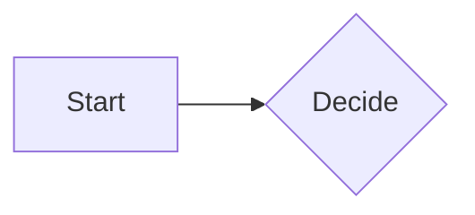

A backtick fence with a language:

```lua
local x = 1
print(x)
```

A backtick fence without a language:

```
plain content
no language
```

A tilde fence with a language:

~~~python
def greet(name):
    return "hi " + name
~~~

A Mermaid block, skipped entirely by block.collect:



An unterminated fence, last in the file:

```sh
echo unterminated
still open
