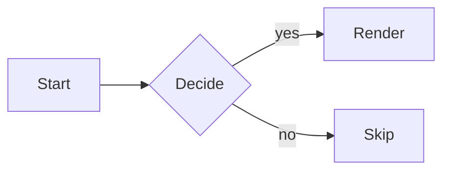

# Reference Document H1 #

An opening paragraph right after the H1, to check that headings and
paragraphs sit next to each other with no blank line added (NFR-I1).

## Heading Level 2

Body text under H2.

### Heading Level 3

Body text under H3.

#### Heading Level 4

Body text under H4.

##### Heading Level 5

Body text under H5.

###### Heading Level 6 ######

Body text under H6, with a closing sequence of hashes above.

Setext Heading One
==================

Body text under the first setext heading (H1 equivalent).

Setext Heading Two
------------------

Body text under the second setext heading (H2 equivalent).

## Inline basics

Emphasis: *single asterisk* and _single underscore_.
Strong: **double asterisk** and __double underscore__.
Strikethrough: ~~struck out~~.
Nested: **strong with *emphasis* inside** and *emphasis with **strong** inside*,
and ***strong emphasis*** and **_strong then emphasis_** and ~~**strike strong**~~.

A code span: `local x = 1` and a multi-backtick span containing a backtick: ``a ` b``.

Backslash escapes: \*not emphasis\*, \_not emphasis\_, \`not code\`, \# not a heading.

Entity references: &amp; and &copy; and numeric &#169; and hex &#xA9;.

An HTML comment on its own line follows.

<!-- this is an html comment -->

Raw HTML stays as source: <span class="tag">inline html</span> in a sentence.

Soft break: this line
continues on the next line with no blank line between them.

Hard break with two trailing spaces:  
this line starts a new visual line.

Hard break with a trailing backslash:\
this line also starts a new visual line.

Links: an inline link [inline link](https://example.com/inline "Inline title"),
a reference link [reference link][ref-1], a collapsed reference [reference link][],
a shortcut reference [shortcut-ref], and an autolink <https://example.com/auto>.

An image:  inline in a sentence.

[reference link]: https://example.com/reference "Reference title"
[ref-1]: https://example.com/ref-1 "Ref one title"
[shortcut-ref]: https://example.com/shortcut "Shortcut title"

---

A thematic break sits above this paragraph.

## Code

An indented code block follows.

    local function greet(name)
      return "hello, " .. name
    end

### Fenced code: Lua

A Lua fenced code block:

```lua
local mada = require("mada")
mada.setup({ ascii = false })
local function width(s)
  return vim.fn.strdisplaywidth(s)
end
```

### Fenced code: Shell

A shell fenced code block:

```sh
#!/bin/sh
set -eu
nvim --headless -u NONE -l test/run.lua "$1"
echo "ran $1"
```

### Fenced code: Fennel

A Fennel fenced code block:

```fennel
(local M {})
(fn M.greet [name]
  (.. "hello, " name))
M
```

### Mermaid diagram

A Mermaid flowchart, already drawn by the time the benchmark measures it:



## Lists

Unordered list, nested:

- top level item one
- top level item two
  - nested item one
  - nested item two
    - doubly nested item
- top level item three

Ordered list, nested:

1. first step
2. second step
   1. first sub-step
   2. second sub-step
3. third step

Task list:

- [ ] an open task
- [x] a done task
- [X] a done task, uppercase
  - [ ] a nested open task
  - [x] a nested done task

## Block quotes

> a top-level quote
>
> > a nested quote
>> a nested quote without the space
> > > a triply nested quote
>
> back to the top level

## Tables

| Left | Center | Right |
| :--- | :---: | ---: |
| a | b | c |
| left-aligned | centered | right-aligned |

### Section 1: mixed content

Paragraph 1 opens with *emphasis*, **strong**, ~~strikethrough~~, and a
`code span 1`, plus an entity &amp; a numeric reference &#161;
and a backslash escape \* that stays literal. This line ends softly,
and continues here as line 1b of the same paragraph.

Line with a hard break via two spaces, index 1:  
the continuation line 1c.

Links in paragraph 1: [inline](https://example.com/1 "t1"),
[ref][ref-1], an autolink <https://example.com/1>, and an image
.

> quote 1 level one
> > quote 1 level two
>
> quote 1 back at level one

- unordered item 1.1
  - unordered item 1.1.1
- unordered item 1.2

1. ordered item 1.1
   1. ordered item 1.1.1
2. ordered item 1.2

- [ ] task 1 open
- [x] task 1 done

| h1-1 | h1-2 |
| --- | --- |
| v1-1 | v1-2 |

    indented code line one
    indented code line two (1)

<!-- a repeated html comment -->

---

#### Section 2: mixed content

Paragraph 2 opens with *emphasis*, **strong**, ~~strikethrough~~, and a
`code span 2`, plus an entity &amp; a numeric reference &#162;
and a backslash escape \* that stays literal. This line ends softly,
and continues here as line 2b of the same paragraph.

Line with a hard break via two spaces, index 2:  
the continuation line 2c.

Links in paragraph 2: [inline](https://example.com/2 "t2"),
[ref][ref-1], an autolink <https://example.com/2>, and an image
.

> quote 2 level one
> > quote 2 level two
>
> quote 2 back at level one

- unordered item 2.1
  - unordered item 2.1.1
- unordered item 2.2

1. ordered item 2.1
   1. ordered item 2.1.1
2. ordered item 2.2

- [ ] task 2 open
- [x] task 2 done

| h2-1 | h2-2 |
| --- | --- |
| v2-1 | v2-2 |

    indented code line one
    indented code line two (2)

<!-- a repeated html comment -->

---

##### Section 3: mixed content

Paragraph 3 opens with *emphasis*, **strong**, ~~strikethrough~~, and a
`code span 3`, plus an entity &amp; a numeric reference &#163;
and a backslash escape \* that stays literal. This line ends softly,
and continues here as line 3b of the same paragraph.

Line with a hard break via two spaces, index 3:  
the continuation line 3c.

Links in paragraph 3: [inline](https://example.com/3 "t3"),
[ref][ref-1], an autolink <https://example.com/3>, and an image
.

> quote 3 level one
> > quote 3 level two
>
> quote 3 back at level one

- unordered item 3.1
  - unordered item 3.1.1
- unordered item 3.2

1. ordered item 3.1
   1. ordered item 3.1.1
2. ordered item 3.2

- [ ] task 3 open
- [x] task 3 done

| h3-1 | h3-2 |
| --- | --- |
| v3-1 | v3-2 |

    indented code line one
    indented code line two (3)

<!-- a repeated html comment -->

---

###### Section 4: mixed content

Paragraph 4 opens with *emphasis*, **strong**, ~~strikethrough~~, and a
`code span 4`, plus an entity &amp; a numeric reference &#164;
and a backslash escape \* that stays literal. This line ends softly,
and continues here as line 4b of the same paragraph.

Line with a hard break via two spaces, index 4:  
the continuation line 4c.

Links in paragraph 4: [inline](https://example.com/4 "t4"),
[ref][ref-1], an autolink <https://example.com/4>, and an image
.

> quote 4 level one
> > quote 4 level two
>
> quote 4 back at level one

- unordered item 4.1
  - unordered item 4.1.1
- unordered item 4.2

1. ordered item 4.1
   1. ordered item 4.1.1
2. ordered item 4.2

- [ ] task 4 open
- [x] task 4 done

| h4-1 | h4-2 |
| --- | --- |
| v4-1 | v4-2 |

    indented code line one
    indented code line two (4)

<!-- a repeated html comment -->

---

## Section 5: mixed content

Paragraph 5 opens with *emphasis*, **strong**, ~~strikethrough~~, and a
`code span 5`, plus an entity &amp; a numeric reference &#165;
and a backslash escape \* that stays literal. This line ends softly,
and continues here as line 5b of the same paragraph.

Line with a hard break via two spaces, index 5:  
the continuation line 5c.

Links in paragraph 5: [inline](https://example.com/5 "t5"),
[ref][ref-1], an autolink <https://example.com/5>, and an image
.

> quote 5 level one
> > quote 5 level two
>
> quote 5 back at level one

- unordered item 5.1
  - unordered item 5.1.1
- unordered item 5.2

1. ordered item 5.1
   1. ordered item 5.1.1
2. ordered item 5.2

- [ ] task 5 open
- [x] task 5 done

| h5-1 | h5-2 |
| --- | --- |
| v5-1 | v5-2 |

    indented code line one
    indented code line two (5)

<!-- a repeated html comment -->

---

### Section 6: mixed content

Paragraph 6 opens with *emphasis*, **strong**, ~~strikethrough~~, and a
`code span 6`, plus an entity &amp; a numeric reference &#166;
and a backslash escape \* that stays literal. This line ends softly,
and continues here as line 6b of the same paragraph.

Line with a hard break via two spaces, index 6:  
the continuation line 6c.

Links in paragraph 6: [inline](https://example.com/6 "t6"),
[ref][ref-1], an autolink <https://example.com/6>, and an image
.

> quote 6 level one
> > quote 6 level two
>
> quote 6 back at level one

- unordered item 6.1
  - unordered item 6.1.1
- unordered item 6.2

1. ordered item 6.1
   1. ordered item 6.1.1
2. ordered item 6.2

- [ ] task 6 open
- [x] task 6 done

| h6-1 | h6-2 |
| --- | --- |
| v6-1 | v6-2 |

    indented code line one
    indented code line two (6)

<!-- a repeated html comment -->

---

#### Section 7: mixed content

Paragraph 7 opens with *emphasis*, **strong**, ~~strikethrough~~, and a
`code span 7`, plus an entity &amp; a numeric reference &#167;
and a backslash escape \* that stays literal. This line ends softly,
and continues here as line 7b of the same paragraph.

Line with a hard break via two spaces, index 7:  
the continuation line 7c.

Links in paragraph 7: [inline](https://example.com/7 "t7"),
[ref][ref-1], an autolink <https://example.com/7>, and an image
.

> quote 7 level one
> > quote 7 level two
>
> quote 7 back at level one

- unordered item 7.1
  - unordered item 7.1.1
- unordered item 7.2

1. ordered item 7.1
   1. ordered item 7.1.1
2. ordered item 7.2

- [ ] task 7 open
- [x] task 7 done

| h7-1 | h7-2 |
| --- | --- |
| v7-1 | v7-2 |

    indented code line one
    indented code line two (7)

<!-- a repeated html comment -->

---

##### Section 8: mixed content

Paragraph 8 opens with *emphasis*, **strong**, ~~strikethrough~~, and a
`code span 8`, plus an entity &amp; a numeric reference &#168;
and a backslash escape \* that stays literal. This line ends softly,
and continues here as line 8b of the same paragraph.

Line with a hard break via two spaces, index 8:  
the continuation line 8c.

Links in paragraph 8: [inline](https://example.com/8 "t8"),
[ref][ref-1], an autolink <https://example.com/8>, and an image
.

> quote 8 level one
> > quote 8 level two
>
> quote 8 back at level one

- unordered item 8.1
  - unordered item 8.1.1
- unordered item 8.2

1. ordered item 8.1
   1. ordered item 8.1.1
2. ordered item 8.2

- [ ] task 8 open
- [x] task 8 done

| h8-1 | h8-2 |
| --- | --- |
| v8-1 | v8-2 |

    indented code line one
    indented code line two (8)

<!-- a repeated html comment -->

---

###### Section 9: mixed content

Paragraph 9 opens with *emphasis*, **strong**, ~~strikethrough~~, and a
`code span 9`, plus an entity &amp; a numeric reference &#169;
and a backslash escape \* that stays literal. This line ends softly,
and continues here as line 9b of the same paragraph.

Line with a hard break via two spaces, index 9:  
the continuation line 9c.

Links in paragraph 9: [inline](https://example.com/9 "t9"),
[ref][ref-1], an autolink <https://example.com/9>, and an image
.

> quote 9 level one
> > quote 9 level two
>
> quote 9 back at level one

- unordered item 9.1
  - unordered item 9.1.1
- unordered item 9.2

1. ordered item 9.1
   1. ordered item 9.1.1
2. ordered item 9.2

- [ ] task 9 open
- [x] task 9 done

| h9-1 | h9-2 |
| --- | --- |
| v9-1 | v9-2 |

    indented code line one
    indented code line two (9)

<!-- a repeated html comment -->

---

## Section 10: mixed content

Paragraph 10 opens with *emphasis*, **strong**, ~~strikethrough~~, and a
`code span 10`, plus an entity &amp; a numeric reference &#170;
and a backslash escape \* that stays literal. This line ends softly,
and continues here as line 10b of the same paragraph.

Line with a hard break via two spaces, index 10:  
the continuation line 10c.

Links in paragraph 10: [inline](https://example.com/10 "t10"),
[ref][ref-1], an autolink <https://example.com/10>, and an image
.

> quote 10 level one
> > quote 10 level two
>
> quote 10 back at level one

- unordered item 10.1
  - unordered item 10.1.1
- unordered item 10.2

1. ordered item 10.1
   1. ordered item 10.1.1
2. ordered item 10.2

- [ ] task 10 open
- [x] task 10 done

| h10-1 | h10-2 |
| --- | --- |
| v10-1 | v10-2 |

    indented code line one
    indented code line two (10)

<!-- a repeated html comment -->

---

### Section 11: mixed content

Paragraph 11 opens with *emphasis*, **strong**, ~~strikethrough~~, and a
`code span 11`, plus an entity &amp; a numeric reference &#171;
and a backslash escape \* that stays literal. This line ends softly,
and continues here as line 11b of the same paragraph.

Line with a hard break via two spaces, index 11:  
the continuation line 11c.

Links in paragraph 11: [inline](https://example.com/11 "t11"),
[ref][ref-1], an autolink <https://example.com/11>, and an image
.

> quote 11 level one
> > quote 11 level two
>
> quote 11 back at level one

- unordered item 11.1
  - unordered item 11.1.1
- unordered item 11.2

1. ordered item 11.1
   1. ordered item 11.1.1
2. ordered item 11.2

- [ ] task 11 open
- [x] task 11 done

| h11-1 | h11-2 |
| --- | --- |
| v11-1 | v11-2 |

    indented code line one
    indented code line two (11)

<!-- a repeated html comment -->

---

#### Section 12: mixed content

Paragraph 12 opens with *emphasis*, **strong**, ~~strikethrough~~, and a
`code span 12`, plus an entity &amp; a numeric reference &#172;
and a backslash escape \* that stays literal. This line ends softly,
and continues here as line 12b of the same paragraph.

Line with a hard break via two spaces, index 12:  
the continuation line 12c.

Links in paragraph 12: [inline](https://example.com/12 "t12"),
[ref][ref-1], an autolink <https://example.com/12>, and an image
.

> quote 12 level one
> > quote 12 level two
>
> quote 12 back at level one

- unordered item 12.1
  - unordered item 12.1.1
- unordered item 12.2

1. ordered item 12.1
   1. ordered item 12.1.1
2. ordered item 12.2

- [ ] task 12 open
- [x] task 12 done

| h12-1 | h12-2 |
| --- | --- |
| v12-1 | v12-2 |

    indented code line one
    indented code line two (12)

<!-- a repeated html comment -->

---

##### Section 13: mixed content

Paragraph 13 opens with *emphasis*, **strong**, ~~strikethrough~~, and a
`code span 13`, plus an entity &amp; a numeric reference &#173;
and a backslash escape \* that stays literal. This line ends softly,
and continues here as line 13b of the same paragraph.

Line with a hard break via two spaces, index 13:  
the continuation line 13c.

Links in paragraph 13: [inline](https://example.com/13 "t13"),
[ref][ref-1], an autolink <https://example.com/13>, and an image
.

> quote 13 level one
> > quote 13 level two
>
> quote 13 back at level one

- unordered item 13.1
  - unordered item 13.1.1
- unordered item 13.2

1. ordered item 13.1
   1. ordered item 13.1.1
2. ordered item 13.2

- [ ] task 13 open
- [x] task 13 done

| h13-1 | h13-2 |
| --- | --- |
| v13-1 | v13-2 |

    indented code line one
    indented code line two (13)

<!-- a repeated html comment -->

---

###### Section 14: mixed content

Paragraph 14 opens with *emphasis*, **strong**, ~~strikethrough~~, and a
`code span 14`, plus an entity &amp; a numeric reference &#174;
and a backslash escape \* that stays literal. This line ends softly,
and continues here as line 14b of the same paragraph.

Line with a hard break via two spaces, index 14:  
the continuation line 14c.

Links in paragraph 14: [inline](https://example.com/14 "t14"),
[ref][ref-1], an autolink <https://example.com/14>, and an image
.

> quote 14 level one
> > quote 14 level two
>
> quote 14 back at level one

- unordered item 14.1
  - unordered item 14.1.1
- unordered item 14.2

1. ordered item 14.1
   1. ordered item 14.1.1
2. ordered item 14.2

- [ ] task 14 open
- [x] task 14 done

| h14-1 | h14-2 |
| --- | --- |
| v14-1 | v14-2 |

    indented code line one
    indented code line two (14)

<!-- a repeated html comment -->

---

## Section 15: mixed content

Paragraph 15 opens with *emphasis*, **strong**, ~~strikethrough~~, and a
`code span 15`, plus an entity &amp; a numeric reference &#175;
and a backslash escape \* that stays literal. This line ends softly,
and continues here as line 15b of the same paragraph.

Line with a hard break via two spaces, index 15:  
the continuation line 15c.

Links in paragraph 15: [inline](https://example.com/15 "t15"),
[ref][ref-1], an autolink <https://example.com/15>, and an image
.

> quote 15 level one
> > quote 15 level two
>
> quote 15 back at level one

- unordered item 15.1
  - unordered item 15.1.1
- unordered item 15.2

1. ordered item 15.1
   1. ordered item 15.1.1
2. ordered item 15.2

- [ ] task 15 open
- [x] task 15 done

| h15-1 | h15-2 |
| --- | --- |
| v15-1 | v15-2 |

    indented code line one
    indented code line two (15)

<!-- a repeated html comment -->

---

### Section 16: mixed content

Paragraph 16 opens with *emphasis*, **strong**, ~~strikethrough~~, and a
`code span 16`, plus an entity &amp; a numeric reference &#176;
and a backslash escape \* that stays literal. This line ends softly,
and continues here as line 16b of the same paragraph.

Line with a hard break via two spaces, index 16:  
the continuation line 16c.

Links in paragraph 16: [inline](https://example.com/16 "t16"),
[ref][ref-1], an autolink <https://example.com/16>, and an image
.

> quote 16 level one
> > quote 16 level two
>
> quote 16 back at level one

- unordered item 16.1
  - unordered item 16.1.1
- unordered item 16.2

1. ordered item 16.1
   1. ordered item 16.1.1
2. ordered item 16.2

- [ ] task 16 open
- [x] task 16 done

| h16-1 | h16-2 |
| --- | --- |
| v16-1 | v16-2 |

    indented code line one
    indented code line two (16)

<!-- a repeated html comment -->

---

#### Section 17: mixed content

Paragraph 17 opens with *emphasis*, **strong**, ~~strikethrough~~, and a
`code span 17`, plus an entity &amp; a numeric reference &#177;
and a backslash escape \* that stays literal. This line ends softly,
and continues here as line 17b of the same paragraph.

Line with a hard break via two spaces, index 17:  
the continuation line 17c.

Links in paragraph 17: [inline](https://example.com/17 "t17"),
[ref][ref-1], an autolink <https://example.com/17>, and an image
.

> quote 17 level one
> > quote 17 level two
>
> quote 17 back at level one

- unordered item 17.1
  - unordered item 17.1.1
- unordered item 17.2

1. ordered item 17.1
   1. ordered item 17.1.1
2. ordered item 17.2

- [ ] task 17 open
- [x] task 17 done

| h17-1 | h17-2 |
| --- | --- |
| v17-1 | v17-2 |

    indented code line one
    indented code line two (17)

<!-- a repeated html comment -->

---

##### Section 18: mixed content

Paragraph 18 opens with *emphasis*, **strong**, ~~strikethrough~~, and a
`code span 18`, plus an entity &amp; a numeric reference &#178;
and a backslash escape \* that stays literal. This line ends softly,
and continues here as line 18b of the same paragraph.

Line with a hard break via two spaces, index 18:  
the continuation line 18c.

Links in paragraph 18: [inline](https://example.com/18 "t18"),
[ref][ref-1], an autolink <https://example.com/18>, and an image
.

> quote 18 level one
> > quote 18 level two
>
> quote 18 back at level one

- unordered item 18.1
  - unordered item 18.1.1
- unordered item 18.2

1. ordered item 18.1
   1. ordered item 18.1.1
2. ordered item 18.2

- [ ] task 18 open
- [x] task 18 done

| h18-1 | h18-2 |
| --- | --- |
| v18-1 | v18-2 |

    indented code line one
    indented code line two (18)

<!-- a repeated html comment -->

---

###### Section 19: mixed content

Paragraph 19 opens with *emphasis*, **strong**, ~~strikethrough~~, and a
`code span 19`, plus an entity &amp; a numeric reference &#179;
and a backslash escape \* that stays literal. This line ends softly,
and continues here as line 19b of the same paragraph.

Line with a hard break via two spaces, index 19:  
the continuation line 19c.

Links in paragraph 19: [inline](https://example.com/19 "t19"),
[ref][ref-1], an autolink <https://example.com/19>, and an image
.

> quote 19 level one
> > quote 19 level two
>
> quote 19 back at level one

- unordered item 19.1
  - unordered item 19.1.1
- unordered item 19.2

1. ordered item 19.1
   1. ordered item 19.1.1
2. ordered item 19.2

- [ ] task 19 open
- [x] task 19 done

| h19-1 | h19-2 |
| --- | --- |
| v19-1 | v19-2 |

    indented code line one
    indented code line two (19)

<!-- a repeated html comment -->

---

## Section 20: mixed content

Paragraph 20 opens with *emphasis*, **strong**, ~~strikethrough~~, and a
`code span 20`, plus an entity &amp; a numeric reference &#180;
and a backslash escape \* that stays literal. This line ends softly,
and continues here as line 20b of the same paragraph.

Line with a hard break via two spaces, index 20:  
the continuation line 20c.

Links in paragraph 20: [inline](https://example.com/20 "t20"),
[ref][ref-1], an autolink <https://example.com/20>, and an image
.

> quote 20 level one
> > quote 20 level two
>
> quote 20 back at level one

- unordered item 20.1
  - unordered item 20.1.1
- unordered item 20.2

1. ordered item 20.1
   1. ordered item 20.1.1
2. ordered item 20.2

- [ ] task 20 open
- [x] task 20 done

| h20-1 | h20-2 |
| --- | --- |
| v20-1 | v20-2 |

    indented code line one
    indented code line two (20)

<!-- a repeated html comment -->

---

### Section 21: mixed content

Paragraph 21 opens with *emphasis*, **strong**, ~~strikethrough~~, and a
`code span 21`, plus an entity &amp; a numeric reference &#181;
and a backslash escape \* that stays literal. This line ends softly,
and continues here as line 21b of the same paragraph.

Line with a hard break via two spaces, index 21:  
the continuation line 21c.

Links in paragraph 21: [inline](https://example.com/21 "t21"),
[ref][ref-1], an autolink <https://example.com/21>, and an image
.

> quote 21 level one
> > quote 21 level two
>
> quote 21 back at level one

- unordered item 21.1
  - unordered item 21.1.1
- unordered item 21.2

1. ordered item 21.1
   1. ordered item 21.1.1
2. ordered item 21.2

- [ ] task 21 open
- [x] task 21 done

| h21-1 | h21-2 |
| --- | --- |
| v21-1 | v21-2 |

    indented code line one
    indented code line two (21)

<!-- a repeated html comment -->

---

#### Section 22: mixed content

Paragraph 22 opens with *emphasis*, **strong**, ~~strikethrough~~, and a
`code span 22`, plus an entity &amp; a numeric reference &#182;
and a backslash escape \* that stays literal. This line ends softly,
and continues here as line 22b of the same paragraph.

Line with a hard break via two spaces, index 22:  
the continuation line 22c.

Links in paragraph 22: [inline](https://example.com/22 "t22"),
[ref][ref-1], an autolink <https://example.com/22>, and an image
.

> quote 22 level one
> > quote 22 level two
>
> quote 22 back at level one

- unordered item 22.1
  - unordered item 22.1.1
- unordered item 22.2

1. ordered item 22.1
   1. ordered item 22.1.1
2. ordered item 22.2

- [ ] task 22 open
- [x] task 22 done

| h22-1 | h22-2 |
| --- | --- |
| v22-1 | v22-2 |

    indented code line one
    indented code line two (22)

<!-- a repeated html comment -->

---

##### Section 23: mixed content

Paragraph 23 opens with *emphasis*, **strong**, ~~strikethrough~~, and a
`code span 23`, plus an entity &amp; a numeric reference &#183;
and a backslash escape \* that stays literal. This line ends softly,
and continues here as line 23b of the same paragraph.

Line with a hard break via two spaces, index 23:  
the continuation line 23c.

Links in paragraph 23: [inline](https://example.com/23 "t23"),
[ref][ref-1], an autolink <https://example.com/23>, and an image
.

> quote 23 level one
> > quote 23 level two
>
> quote 23 back at level one

- unordered item 23.1
  - unordered item 23.1.1
- unordered item 23.2

1. ordered item 23.1
   1. ordered item 23.1.1
2. ordered item 23.2

- [ ] task 23 open
- [x] task 23 done

| h23-1 | h23-2 |
| --- | --- |
| v23-1 | v23-2 |

    indented code line one
    indented code line two (23)

<!-- a repeated html comment -->

---

###### Section 24: mixed content

Paragraph 24 opens with *emphasis*, **strong**, ~~strikethrough~~, and a
`code span 24`, plus an entity &amp; a numeric reference &#184;
and a backslash escape \* that stays literal. This line ends softly,
and continues here as line 24b of the same paragraph.

Line with a hard break via two spaces, index 24:  
the continuation line 24c.

Links in paragraph 24: [inline](https://example.com/24 "t24"),
[ref][ref-1], an autolink <https://example.com/24>, and an image
.

> quote 24 level one
> > quote 24 level two
>
> quote 24 back at level one

- unordered item 24.1
  - unordered item 24.1.1
- unordered item 24.2

1. ordered item 24.1
   1. ordered item 24.1.1
2. ordered item 24.2

- [ ] task 24 open
- [x] task 24 done

| h24-1 | h24-2 |
| --- | --- |
| v24-1 | v24-2 |

    indented code line one
    indented code line two (24)

<!-- a repeated html comment -->

---

## Section 25: mixed content

Paragraph 25 opens with *emphasis*, **strong**, ~~strikethrough~~, and a
`code span 25`, plus an entity &amp; a numeric reference &#185;
and a backslash escape \* that stays literal. This line ends softly,
and continues here as line 25b of the same paragraph.

Line with a hard break via two spaces, index 25:  
the continuation line 25c.

Links in paragraph 25: [inline](https://example.com/25 "t25"),
[ref][ref-1], an autolink <https://example.com/25>, and an image
.

> quote 25 level one
> > quote 25 level two
>
> quote 25 back at level one

- unordered item 25.1
  - unordered item 25.1.1
- unordered item 25.2

1. ordered item 25.1
   1. ordered item 25.1.1
2. ordered item 25.2

- [ ] task 25 open
- [x] task 25 done

| h25-1 | h25-2 |
| --- | --- |
| v25-1 | v25-2 |

    indented code line one
    indented code line two (25)

<!-- a repeated html comment -->

---

### Section 26: mixed content

Paragraph 26 opens with *emphasis*, **strong**, ~~strikethrough~~, and a
`code span 26`, plus an entity &amp; a numeric reference &#186;
and a backslash escape \* that stays literal. This line ends softly,
and continues here as line 26b of the same paragraph.

Line with a hard break via two spaces, index 26:  
the continuation line 26c.

Links in paragraph 26: [inline](https://example.com/26 "t26"),
[ref][ref-1], an autolink <https://example.com/26>, and an image
.

> quote 26 level one
> > quote 26 level two
>
> quote 26 back at level one

- unordered item 26.1
  - unordered item 26.1.1
- unordered item 26.2

1. ordered item 26.1
   1. ordered item 26.1.1
2. ordered item 26.2

- [ ] task 26 open
- [x] task 26 done

| h26-1 | h26-2 |
| --- | --- |
| v26-1 | v26-2 |

    indented code line one
    indented code line two (26)

<!-- a repeated html comment -->

---

#### Section 27: mixed content

Paragraph 27 opens with *emphasis*, **strong**, ~~strikethrough~~, and a
`code span 27`, plus an entity &amp; a numeric reference &#187;
and a backslash escape \* that stays literal. This line ends softly,
and continues here as line 27b of the same paragraph.

Line with a hard break via two spaces, index 27:  
the continuation line 27c.

Links in paragraph 27: [inline](https://example.com/27 "t27"),
[ref][ref-1], an autolink <https://example.com/27>, and an image
.

> quote 27 level one
> > quote 27 level two
>
> quote 27 back at level one

- unordered item 27.1
  - unordered item 27.1.1
- unordered item 27.2

1. ordered item 27.1
   1. ordered item 27.1.1
2. ordered item 27.2

- [ ] task 27 open
- [x] task 27 done

| h27-1 | h27-2 |
| --- | --- |
| v27-1 | v27-2 |

    indented code line one
    indented code line two (27)

<!-- a repeated html comment -->

---

##### Section 28: mixed content

Paragraph 28 opens with *emphasis*, **strong**, ~~strikethrough~~, and a
`code span 28`, plus an entity &amp; a numeric reference &#188;
and a backslash escape \* that stays literal. This line ends softly,
and continues here as line 28b of the same paragraph.

Line with a hard break via two spaces, index 28:  
the continuation line 28c.

Links in paragraph 28: [inline](https://example.com/28 "t28"),
[ref][ref-1], an autolink <https://example.com/28>, and an image
.

> quote 28 level one
> > quote 28 level two
>
> quote 28 back at level one

- unordered item 28.1
  - unordered item 28.1.1
- unordered item 28.2

1. ordered item 28.1
   1. ordered item 28.1.1
2. ordered item 28.2

- [ ] task 28 open
- [x] task 28 done

| h28-1 | h28-2 |
| --- | --- |
| v28-1 | v28-2 |

    indented code line one
    indented code line two (28)

<!-- a repeated html comment -->

---

###### Section 29: mixed content

Paragraph 29 opens with *emphasis*, **strong**, ~~strikethrough~~, and a
`code span 29`, plus an entity &amp; a numeric reference &#189;
and a backslash escape \* that stays literal. This line ends softly,
and continues here as line 29b of the same paragraph.

Line with a hard break via two spaces, index 29:  
the continuation line 29c.

Links in paragraph 29: [inline](https://example.com/29 "t29"),
[ref][ref-1], an autolink <https://example.com/29>, and an image
.

> quote 29 level one
> > quote 29 level two
>
> quote 29 back at level one

- unordered item 29.1
  - unordered item 29.1.1
- unordered item 29.2

1. ordered item 29.1
   1. ordered item 29.1.1
2. ordered item 29.2

- [ ] task 29 open
- [x] task 29 done

| h29-1 | h29-2 |
| --- | --- |
| v29-1 | v29-2 |

    indented code line one
    indented code line two (29)

<!-- a repeated html comment -->

---

## Section 30: mixed content

Paragraph 30 opens with *emphasis*, **strong**, ~~strikethrough~~, and a
`code span 30`, plus an entity &amp; a numeric reference &#190;
and a backslash escape \* that stays literal. This line ends softly,
and continues here as line 30b of the same paragraph.

Line with a hard break via two spaces, index 30:  
the continuation line 30c.

Links in paragraph 30: [inline](https://example.com/30 "t30"),
[ref][ref-1], an autolink <https://example.com/30>, and an image
.

> quote 30 level one
> > quote 30 level two
>
> quote 30 back at level one

- unordered item 30.1
  - unordered item 30.1.1
- unordered item 30.2

1. ordered item 30.1
   1. ordered item 30.1.1
2. ordered item 30.2

- [ ] task 30 open
- [x] task 30 done

| h30-1 | h30-2 |
| --- | --- |
| v30-1 | v30-2 |

    indented code line one
    indented code line two (30)

<!-- a repeated html comment -->

---

### Section 31: mixed content

Paragraph 31 opens with *emphasis*, **strong**, ~~strikethrough~~, and a
`code span 31`, plus an entity &amp; a numeric reference &#191;
and a backslash escape \* that stays literal. This line ends softly,
and continues here as line 31b of the same paragraph.

Line with a hard break via two spaces, index 31:  
the continuation line 31c.

Links in paragraph 31: [inline](https://example.com/31 "t31"),
[ref][ref-1], an autolink <https://example.com/31>, and an image
.

> quote 31 level one
> > quote 31 level two
>
> quote 31 back at level one

- unordered item 31.1
  - unordered item 31.1.1
- unordered item 31.2

1. ordered item 31.1
   1. ordered item 31.1.1
2. ordered item 31.2

- [ ] task 31 open
- [x] task 31 done

| h31-1 | h31-2 |
| --- | --- |
| v31-1 | v31-2 |

    indented code line one
    indented code line two (31)

<!-- a repeated html comment -->

---

#### Section 32: mixed content

Paragraph 32 opens with *emphasis*, **strong**, ~~strikethrough~~, and a
`code span 32`, plus an entity &amp; a numeric reference &#192;
and a backslash escape \* that stays literal. This line ends softly,
and continues here as line 32b of the same paragraph.

Line with a hard break via two spaces, index 32:  
the continuation line 32c.

Links in paragraph 32: [inline](https://example.com/32 "t32"),
[ref][ref-1], an autolink <https://example.com/32>, and an image
.

> quote 32 level one
> > quote 32 level two
>
> quote 32 back at level one

- unordered item 32.1
  - unordered item 32.1.1
- unordered item 32.2

1. ordered item 32.1
   1. ordered item 32.1.1
2. ordered item 32.2

- [ ] task 32 open
- [x] task 32 done

| h32-1 | h32-2 |
| --- | --- |
| v32-1 | v32-2 |

    indented code line one
    indented code line two (32)

<!-- a repeated html comment -->

---

##### Section 33: mixed content

Paragraph 33 opens with *emphasis*, **strong**, ~~strikethrough~~, and a
`code span 33`, plus an entity &amp; a numeric reference &#193;
and a backslash escape \* that stays literal. This line ends softly,
and continues here as line 33b of the same paragraph.

Line with a hard break via two spaces, index 33:  
the continuation line 33c.

Links in paragraph 33: [inline](https://example.com/33 "t33"),
[ref][ref-1], an autolink <https://example.com/33>, and an image
.

> quote 33 level one
> > quote 33 level two
>
> quote 33 back at level one

- unordered item 33.1
  - unordered item 33.1.1
- unordered item 33.2

1. ordered item 33.1
   1. ordered item 33.1.1
2. ordered item 33.2

- [ ] task 33 open
- [x] task 33 done

| h33-1 | h33-2 |
| --- | --- |
| v33-1 | v33-2 |

    indented code line one
    indented code line two (33)

<!-- a repeated html comment -->

---

###### Section 34: mixed content

Paragraph 34 opens with *emphasis*, **strong**, ~~strikethrough~~, and a
`code span 34`, plus an entity &amp; a numeric reference &#194;
and a backslash escape \* that stays literal. This line ends softly,
and continues here as line 34b of the same paragraph.

Line with a hard break via two spaces, index 34:  
the continuation line 34c.

Links in paragraph 34: [inline](https://example.com/34 "t34"),
[ref][ref-1], an autolink <https://example.com/34>, and an image
.

> quote 34 level one
> > quote 34 level two
>
> quote 34 back at level one

- unordered item 34.1
  - unordered item 34.1.1
- unordered item 34.2

1. ordered item 34.1
   1. ordered item 34.1.1
2. ordered item 34.2

- [ ] task 34 open
- [x] task 34 done

| h34-1 | h34-2 |
| --- | --- |
| v34-1 | v34-2 |

    indented code line one
    indented code line two (34)

<!-- a repeated html comment -->

---

## Section 35: mixed content

Paragraph 35 opens with *emphasis*, **strong**, ~~strikethrough~~, and a
`code span 35`, plus an entity &amp; a numeric reference &#195;
and a backslash escape \* that stays literal. This line ends softly,
and continues here as line 35b of the same paragraph.

Line with a hard break via two spaces, index 35:  
the continuation line 35c.

Links in paragraph 35: [inline](https://example.com/35 "t35"),
[ref][ref-1], an autolink <https://example.com/35>, and an image
.

> quote 35 level one
> > quote 35 level two
>
> quote 35 back at level one

- unordered item 35.1
  - unordered item 35.1.1
- unordered item 35.2

1. ordered item 35.1
   1. ordered item 35.1.1
2. ordered item 35.2

- [ ] task 35 open
- [x] task 35 done

| h35-1 | h35-2 |
| --- | --- |
| v35-1 | v35-2 |

    indented code line one
    indented code line two (35)

<!-- a repeated html comment -->

---

### Section 36: mixed content

Paragraph 36 opens with *emphasis*, **strong**, ~~strikethrough~~, and a
`code span 36`, plus an entity &amp; a numeric reference &#196;
and a backslash escape \* that stays literal. This line ends softly,
and continues here as line 36b of the same paragraph.

Line with a hard break via two spaces, index 36:  
the continuation line 36c.

Links in paragraph 36: [inline](https://example.com/36 "t36"),
[ref][ref-1], an autolink <https://example.com/36>, and an image
.

> quote 36 level one
> > quote 36 level two
>
> quote 36 back at level one

- unordered item 36.1
  - unordered item 36.1.1
- unordered item 36.2

1. ordered item 36.1
   1. ordered item 36.1.1
2. ordered item 36.2

- [ ] task 36 open
- [x] task 36 done

| h36-1 | h36-2 |
| --- | --- |
| v36-1 | v36-2 |

    indented code line one
    indented code line two (36)

<!-- a repeated html comment -->

---

#### Section 37: mixed content

Paragraph 37 opens with *emphasis*, **strong**, ~~strikethrough~~, and a
`code span 37`, plus an entity &amp; a numeric reference &#197;
and a backslash escape \* that stays literal. This line ends softly,
and continues here as line 37b of the same paragraph.

Line with a hard break via two spaces, index 37:  
the continuation line 37c.

Links in paragraph 37: [inline](https://example.com/37 "t37"),
[ref][ref-1], an autolink <https://example.com/37>, and an image
.

> quote 37 level one
> > quote 37 level two
>
> quote 37 back at level one

- unordered item 37.1
  - unordered item 37.1.1
- unordered item 37.2

1. ordered item 37.1
   1. ordered item 37.1.1
2. ordered item 37.2

- [ ] task 37 open
- [x] task 37 done

| h37-1 | h37-2 |
| --- | --- |
| v37-1 | v37-2 |

    indented code line one
    indented code line two (37)

<!-- a repeated html comment -->

---

##### Section 38: mixed content

Paragraph 38 opens with *emphasis*, **strong**, ~~strikethrough~~, and a
`code span 38`, plus an entity &amp; a numeric reference &#198;
and a backslash escape \* that stays literal. This line ends softly,
and continues here as line 38b of the same paragraph.

Line with a hard break via two spaces, index 38:  
the continuation line 38c.

Links in paragraph 38: [inline](https://example.com/38 "t38"),
[ref][ref-1], an autolink <https://example.com/38>, and an image
.

> quote 38 level one
> > quote 38 level two
>
> quote 38 back at level one

- unordered item 38.1
  - unordered item 38.1.1
- unordered item 38.2

1. ordered item 38.1
   1. ordered item 38.1.1
2. ordered item 38.2

- [ ] task 38 open
- [x] task 38 done

| h38-1 | h38-2 |
| --- | --- |
| v38-1 | v38-2 |

    indented code line one
    indented code line two (38)

<!-- a repeated html comment -->

---

###### Section 39: mixed content

Paragraph 39 opens with *emphasis*, **strong**, ~~strikethrough~~, and a
`code span 39`, plus an entity &amp; a numeric reference &#199;
and a backslash escape \* that stays literal. This line ends softly,
and continues here as line 39b of the same paragraph.

Line with a hard break via two spaces, index 39:  
the continuation line 39c.

Links in paragraph 39: [inline](https://example.com/39 "t39"),
[ref][ref-1], an autolink <https://example.com/39>, and an image
.

> quote 39 level one
> > quote 39 level two
>
> quote 39 back at level one

- unordered item 39.1
  - unordered item 39.1.1
- unordered item 39.2

1. ordered item 39.1
   1. ordered item 39.1.1
2. ordered item 39.2

- [ ] task 39 open
- [x] task 39 done

| h39-1 | h39-2 |
| --- | --- |
| v39-1 | v39-2 |

    indented code line one
    indented code line two (39)

<!-- a repeated html comment -->

---

## Section 40: mixed content

Paragraph 40 opens with *emphasis*, **strong**, ~~strikethrough~~, and a
`code span 40`, plus an entity &amp; a numeric reference &#200;
and a backslash escape \* that stays literal. This line ends softly,
and continues here as line 40b of the same paragraph.

Line with a hard break via two spaces, index 40:  
the continuation line 40c.

Links in paragraph 40: [inline](https://example.com/40 "t40"),
[ref][ref-1], an autolink <https://example.com/40>, and an image
.

> quote 40 level one
> > quote 40 level two
>
> quote 40 back at level one

- unordered item 40.1
  - unordered item 40.1.1
- unordered item 40.2

1. ordered item 40.1
   1. ordered item 40.1.1
2. ordered item 40.2

- [ ] task 40 open
- [x] task 40 done

| h40-1 | h40-2 |
| --- | --- |
| v40-1 | v40-2 |

    indented code line one
    indented code line two (40)

<!-- a repeated html comment -->

---

### Section 41: mixed content

Paragraph 41 opens with *emphasis*, **strong**, ~~strikethrough~~, and a
`code span 41`, plus an entity &amp; a numeric reference &#201;
and a backslash escape \* that stays literal. This line ends softly,
and continues here as line 41b of the same paragraph.

Line with a hard break via two spaces, index 41:  
the continuation line 41c.

Links in paragraph 41: [inline](https://example.com/41 "t41"),
[ref][ref-1], an autolink <https://example.com/41>, and an image
.

> quote 41 level one
> > quote 41 level two
>
> quote 41 back at level one

- unordered item 41.1
  - unordered item 41.1.1
- unordered item 41.2

1. ordered item 41.1
   1. ordered item 41.1.1
2. ordered item 41.2

- [ ] task 41 open
- [x] task 41 done

| h41-1 | h41-2 |
| --- | --- |
| v41-1 | v41-2 |

    indented code line one
    indented code line two (41)

<!-- a repeated html comment -->

---

#### Section 42: mixed content

Paragraph 42 opens with *emphasis*, **strong**, ~~strikethrough~~, and a
`code span 42`, plus an entity &amp; a numeric reference &#202;
and a backslash escape \* that stays literal. This line ends softly,
and continues here as line 42b of the same paragraph.

Line with a hard break via two spaces, index 42:  
the continuation line 42c.

Links in paragraph 42: [inline](https://example.com/42 "t42"),
[ref][ref-1], an autolink <https://example.com/42>, and an image
.

> quote 42 level one
> > quote 42 level two
>
> quote 42 back at level one

- unordered item 42.1
  - unordered item 42.1.1
- unordered item 42.2

1. ordered item 42.1
   1. ordered item 42.1.1
2. ordered item 42.2

- [ ] task 42 open
- [x] task 42 done

| h42-1 | h42-2 |
| --- | --- |
| v42-1 | v42-2 |

    indented code line one
    indented code line two (42)

<!-- a repeated html comment -->

---

##### Section 43: mixed content

Paragraph 43 opens with *emphasis*, **strong**, ~~strikethrough~~, and a
`code span 43`, plus an entity &amp; a numeric reference &#203;
and a backslash escape \* that stays literal. This line ends softly,
and continues here as line 43b of the same paragraph.

Line with a hard break via two spaces, index 43:  
the continuation line 43c.

Links in paragraph 43: [inline](https://example.com/43 "t43"),
[ref][ref-1], an autolink <https://example.com/43>, and an image
.

> quote 43 level one
> > quote 43 level two
>
> quote 43 back at level one

- unordered item 43.1
  - unordered item 43.1.1
- unordered item 43.2

1. ordered item 43.1
   1. ordered item 43.1.1
2. ordered item 43.2

- [ ] task 43 open
- [x] task 43 done

| h43-1 | h43-2 |
| --- | --- |
| v43-1 | v43-2 |

    indented code line one
    indented code line two (43)

<!-- a repeated html comment -->

---

###### Section 44: mixed content

Paragraph 44 opens with *emphasis*, **strong**, ~~strikethrough~~, and a
`code span 44`, plus an entity &amp; a numeric reference &#204;
and a backslash escape \* that stays literal. This line ends softly,
and continues here as line 44b of the same paragraph.

Line with a hard break via two spaces, index 44:  
the continuation line 44c.

Links in paragraph 44: [inline](https://example.com/44 "t44"),
[ref][ref-1], an autolink <https://example.com/44>, and an image
.

> quote 44 level one
> > quote 44 level two
>
> quote 44 back at level one

- unordered item 44.1
  - unordered item 44.1.1
- unordered item 44.2

1. ordered item 44.1
   1. ordered item 44.1.1
2. ordered item 44.2

- [ ] task 44 open
- [x] task 44 done

| h44-1 | h44-2 |
| --- | --- |
| v44-1 | v44-2 |

    indented code line one
    indented code line two (44)

<!-- a repeated html comment -->

---

## Section 45: mixed content

Paragraph 45 opens with *emphasis*, **strong**, ~~strikethrough~~, and a
`code span 45`, plus an entity &amp; a numeric reference &#205;
and a backslash escape \* that stays literal. This line ends softly,
and continues here as line 45b of the same paragraph.

Line with a hard break via two spaces, index 45:  
the continuation line 45c.

Links in paragraph 45: [inline](https://example.com/45 "t45"),
[ref][ref-1], an autolink <https://example.com/45>, and an image
.

> quote 45 level one
> > quote 45 level two
>
> quote 45 back at level one

- unordered item 45.1
  - unordered item 45.1.1
- unordered item 45.2

1. ordered item 45.1
   1. ordered item 45.1.1
2. ordered item 45.2

- [ ] task 45 open
- [x] task 45 done

| h45-1 | h45-2 |
| --- | --- |
| v45-1 | v45-2 |

    indented code line one
    indented code line two (45)

<!-- a repeated html comment -->

---

